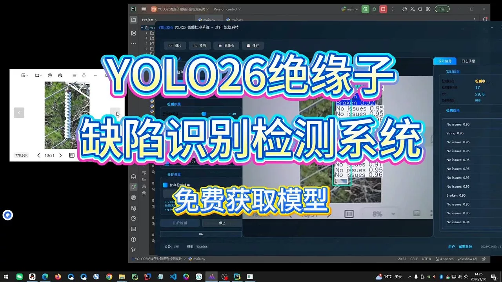
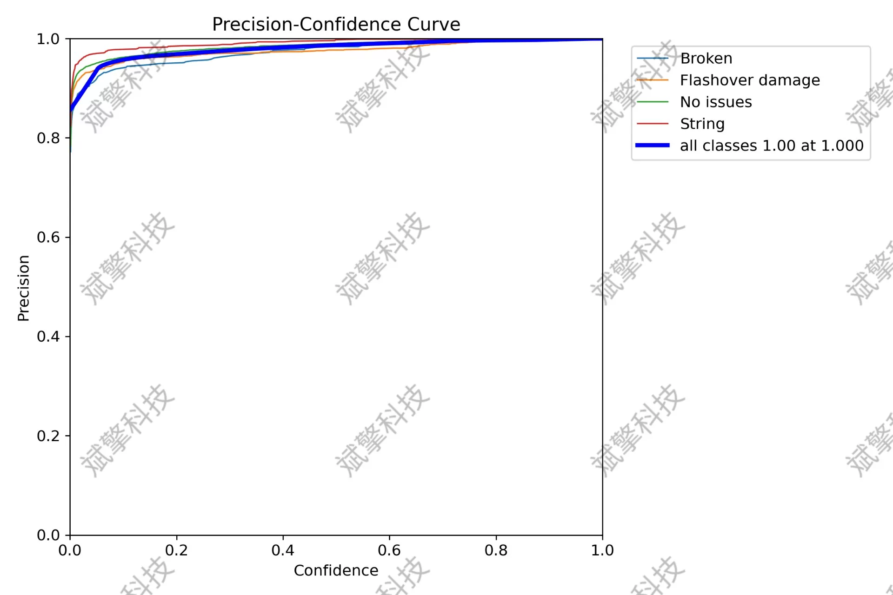
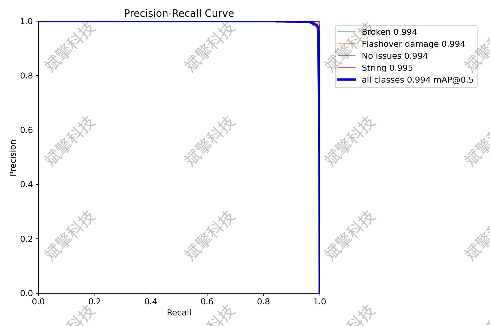
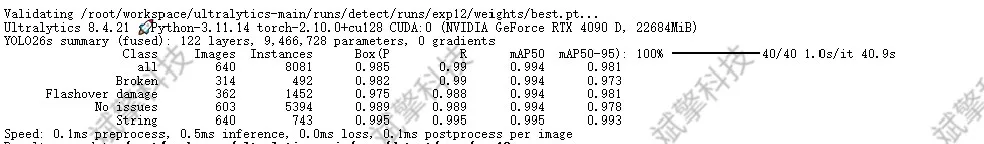
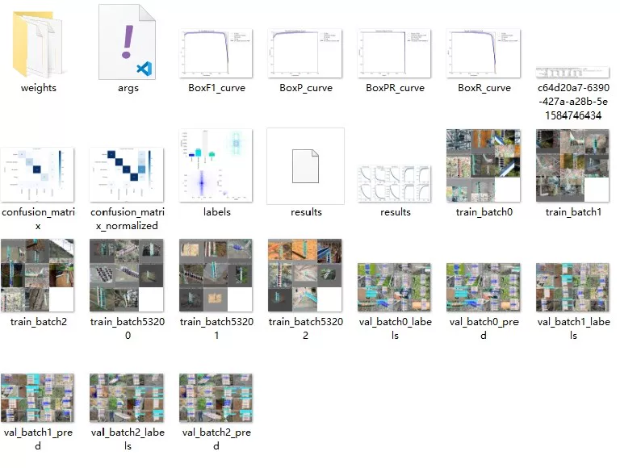
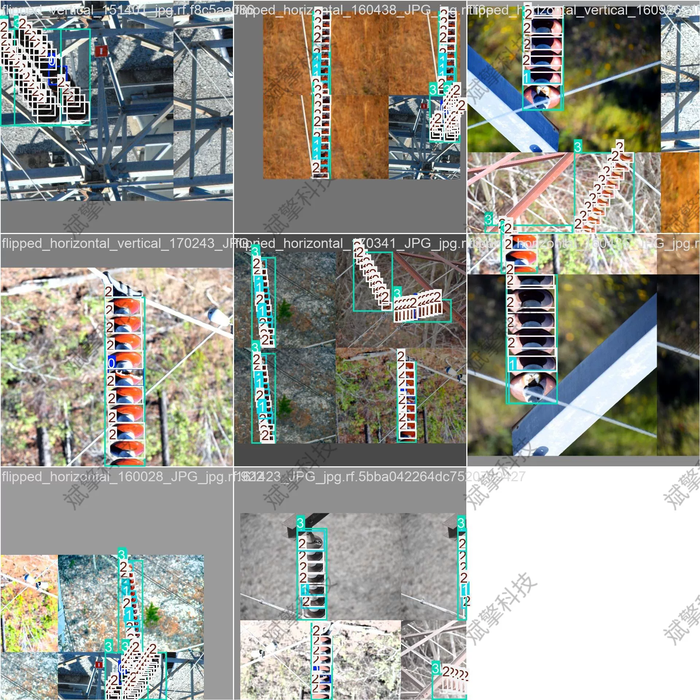
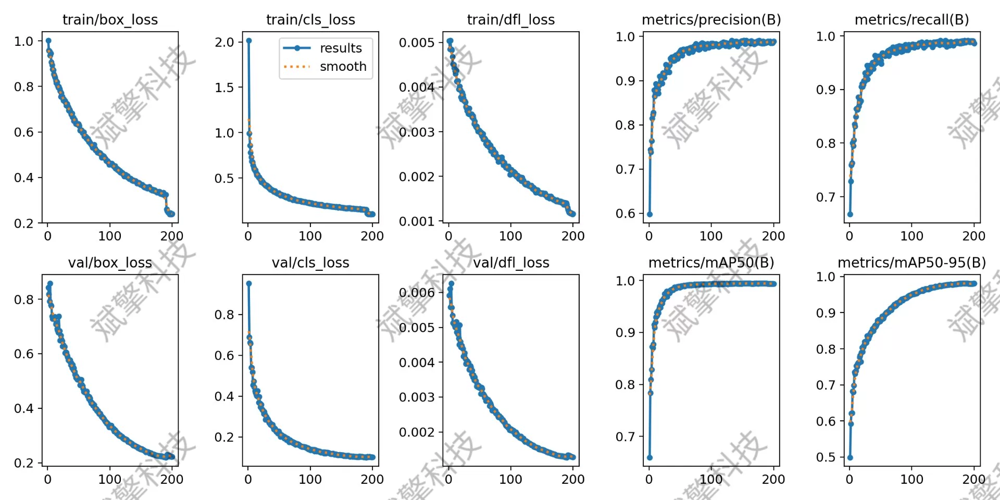
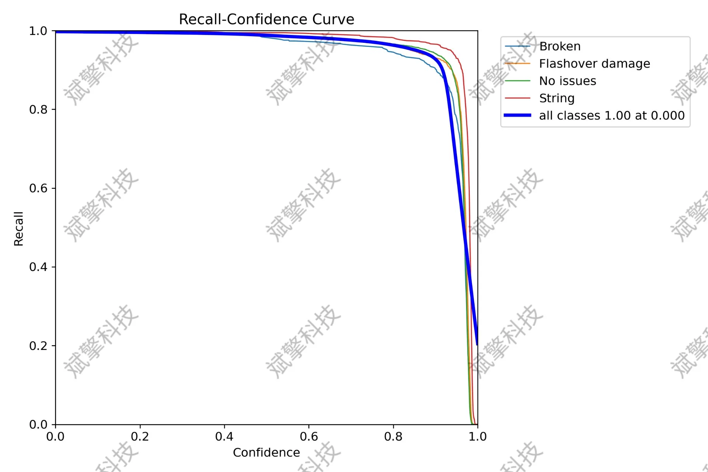
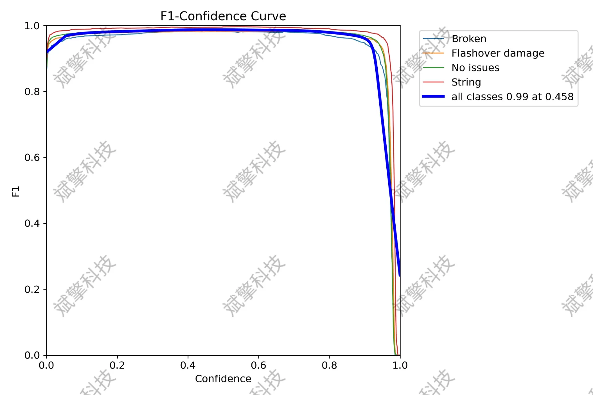

# YOLO26 Insulator Defect Detection System | Source Code

## Body

YOLO26 Insulator Defect Detection System | Source Code: The YOLO26 Insulator Defect Detection System achieves an mAP@0.5 of 0.994, with a four-class precision recognition for broken/flashover/no defect/insulator string

This study proposes an intelligent insulator defect detection system based on the YOLO26 architecture. Addressing the challenges of low efficiency in manual inspections, high missed rates, and significant environmental risks in power system inspections, this system utilizes deep learning techniques to achieve automated and high-precision determination of insulator status. The dataset consists of 3200 images (2240 training, 640 validation, and 320 test), covering four key categories: broken, flashover damage, no defect, and insulator string. Experimental results show that the model performs excellently on the test set, achieving an mAP@0.5 of 0.994, with precision and recall rates close to 1.0 for all categories. A confusion matrix analysis indicates strong discriminative capability between different defect types, with very low misjudgment rates. This system can effectively assist power maintenance personnel in identifying defects efficiently and accurately, demonstrating significant engineering application value.

The dataset contains 4 categories, focusing on the main concerns in insulator inspection:
Broken (broken): Marks physical fractures or damaged areas on the umbrella skirt or core rod of the insulator.
Flashover damage (flashover damage): Marks burnt, blackened, or electrical arc traces caused by discharge on the surface of the insulator.
No issues (no defect): Marks insulators with intact appearance and no visible damage.
String (insulator string): Marks the overall contour of the entire insulator string for aiding in positioning and counting.

Training set: 2240 images used for model parameter learning and weight update.
Validation set: 640 images used during training to monitor model performance, adjust hyperparameters, and prevent overfitting.
Test set: 320 images used for final evaluation of the model's generalization ability, reflecting its true performance on unseen data.

Dataset total: 804 labeled images
Training set: 643 images (80% of total)
Validation set: 80 images (10% of total)
Test set: 81 images (10% of total)

Free reservation for remote installation. Unsuccessful full refund.
Purchase includes the following resources (accessed via Baidu Cloud):
- Full source code for YOLO recognition detection projects
- YOLO format datasets
- Training code + UI interface code
- Trained model + result images
- Software installation package
- Add WeChat for remote installation reservation (automatically displayed after purchase) - Unsuccessful, full refund guaranteed

⚙️ Core functionality modules
Detection capabilities
- Image detection: upload and immediately detect, returning detection boxes + category information
- Video detection: supports video files, analyzing frames precisely
- Camera real-time detection: connects USB camera for dynamic monitoring
Interaction and control
- Target selection: freely choose one or more categories for detection
- Parameter adjustment: adjustable confidence threshold & IoU threshold, flexible control of accuracy
- Results saving: save images/video/camera detection results in one click
System and data
- User login registration: supports password strength checking + encryption storage
- Log recording: automatically records operation and error information (timestamped)

## Images

## Payment

Here is a pay link on Stripe ( https://buy.stripe.com/3cs8yP7sY87d0vu9AB ). Please contact me lonlonago@foxmail.com after funding $89, and I will send you a complete data files , thank you!

